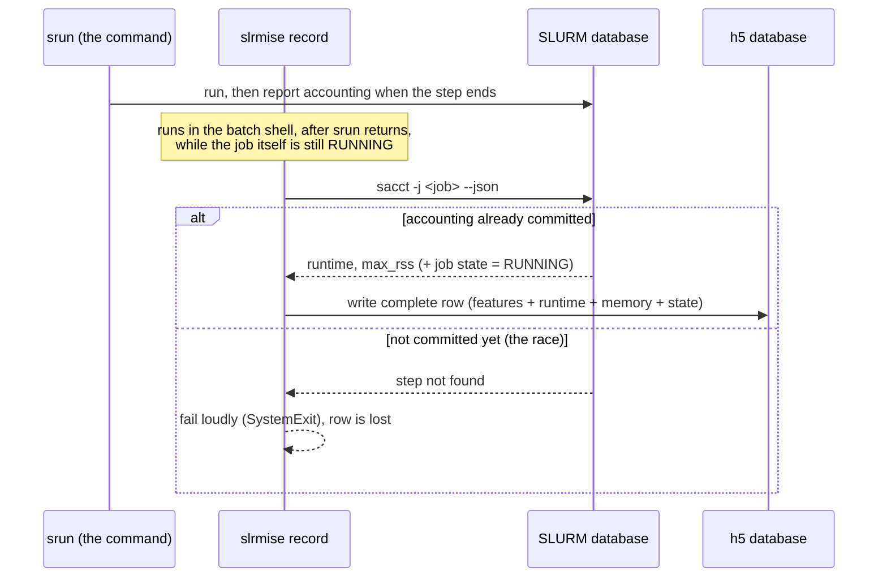
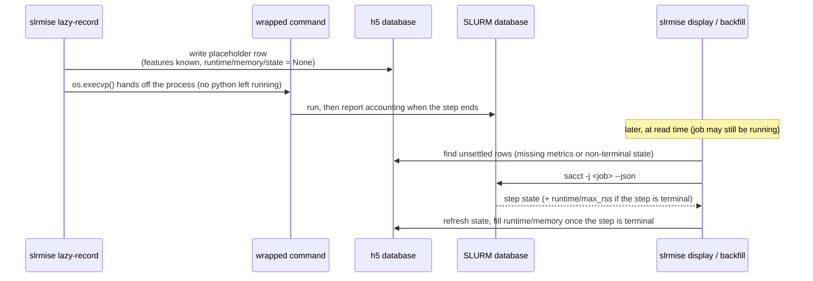

# Proposal: Using slurmise to wrap the command

This was motivated by looking at slurmise tutorial and not liking how
we need specify the job parameters twice:

```bash
srun ../bin/perfectScaler --intensity 5000 --duration 10

slurmise --toml slurmise.toml record \
    "perfectScaler --intensity 5000 --duration 10"
```

Yes, we could use a variable to avoid the duplication:
```bash
CMD="../bin/perfectScaler --intensity 5000 --duration 10"
srun $CMD
slurmise --toml slurmise.toml record $CMD
```

But it would be nice if slurmise could "wrap" a command like `time` does:
```bash
srun slurmise --toml slurmise.toml record -- \
    ../bin/perfectScaler --intensity 5000 --duration 10
```

An added benefit of this "wrap" approach is that slurmise is running
inside the srun environment and will have access to the `SLURM_STEP_ID`
environment variable.

To test whether this is possible, I've made the `./slrmise` prototype
as a stand-in for the real `slurmise`. It's a small python script that
imports and uses the `slurmise` code without modifications, but has a new CLI
and some slightly different behavior.

## `./slrmise record` (run the command then record)

Run *after* `srun cmd` completes, passing the command as a single quoted
string, exactly like slurmise does currently:

```bash
srun ../bin/perfectScaler --intensity 5000 --duration 10

./slrmise --toml slurmise.toml record "perfectScaler --intensity 5000 --duration 10"
```



Trade-offs:
- **Read-your-writes**: the row is fully populated (runtime, max_rss, state)
  as soon as `record` returns, no later backfill step needed.
- **Racy**: there's no guarantee `sacct`/slurmdbd has committed the job's
  accounting data by the time `record` runs right after `srun`. If it hasn't,
  `record` fails loudly rather than silently retrying
- **Double specification**: the command has to be written out twice (once for
  `srun`, once quoted for `record`)

## `./slrmise lazy-record` (wrap the command, record a placeholder, and fill in later)

Wraps the command directly, specified once:

```bash
srun ./slrmise --toml slurmise.toml lazy-record -- \
    ../bin/perfectScaler --intensity 5000 --duration 10
```

It inserts a placeholder in the .h5 database with the
features known, such as intensity and duration in this example.
But the runtime/memory aren't known yet and are given "None"
because the lazy-record happens before the perfectScaler command is run.

After inserting this placeholder in the .h5 slrmise replaces itself with the
wrapped command via `os.execvp` -- there is no python process left alive during
the run, so exit codes, signals, and memory accounting all belong to the real
command with no wrapper overhead or corruption.

Slurmise's HDF5 `JobDatabase` already supports this "placeholder"
approach natively: `record()` simply omits the memory/runtime datasets when
they are unknown, and `job_database.update_missing_data()` fills them from
sacct later.

time/mem are filled in later, at read time with the `./slrmise display` or
`./slrmise backfill` subcommand. This backfill re-checks every row that hasn't
*settled* -- a row is settled once it has both metrics **and** a terminal state
(`COMPLETED/FAILED/TIMEOUT/OUT_OF_MEMORY/CANCELLED`); anything else is looked up
in `sacct` again on the next read.



Trade-offs:
- Single specification, only have to list the command once
- Access to `SLURM_STEP_ID`. All recorded jobs are the form `<slurm_id>.<step_id>`
- Metrics aren't available until calls to `display`/`backfill` after
  the job finishes. "Eventual consistency"

## `./slrmise backfill`

Backfills the .h5 missing Time/Mem/State values

## `./slrmise display`

Backfills the .h5 then displays the contents

## `./slrmise no-update-display`

prints the database as-is without backfilling, useful for
seeing which lazy rows are still pending while a job runs.

# Examples

The .sbatch scripts show how we might use either of these approaches
